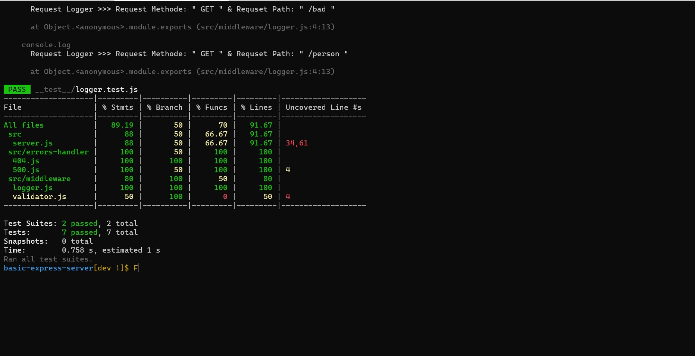

# Lab 02 - Basic-Express-Server

##### Author : Ibrahim Khdairat 

* [GitHub Repo Link](https://github.com/Ibrahim-Khdairat/basic-express-server)

* [Heroku Link](https://ibrahim-basic-express-server.herokuapp.com/) : https://ibrahim-basic-express-server.herokuapp.com/

##### Setup
`.env` requirements
  * `PORT` - Port Number

**Running the app**
* `npm start`
* Endpoints:
* ##### 1 -  `/status`
Returns Object

>{
  "domain": "ibrahim-basic-express-server.herokuapp.com",
  "status": "running",
  "port": 3000
}

* ##### 2 -  `https://ibrahim-basic-express-server.herokuapp.com/person?name=<Enter Your Name Here>`

> *You should enter your name in the search query or you'll get an 404 Not Found Error*

Returns Object

>{
  "name": "Your Name Will Display Here",
}

**Tests**
* Unit Tests: `npm run test`

**Test Result**

